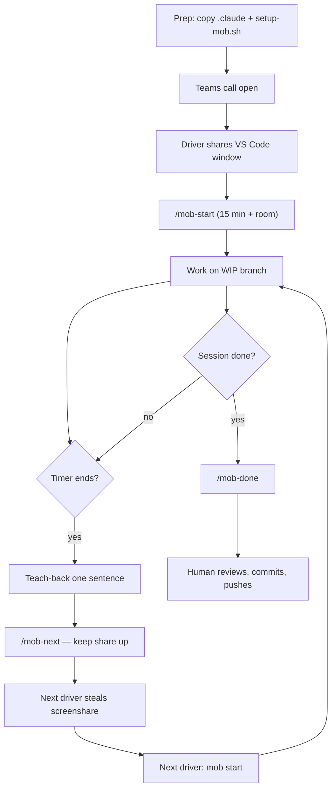
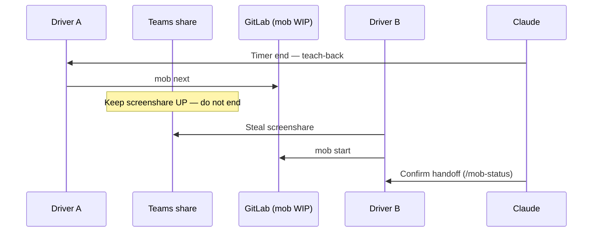

# Claude-led light mob + mob.sh

> **Never done this? Start here → [GETTING-STARTED.md](GETTING-STARTED.md)**

**Watch (setup/install, ~1 min)** — plays on GitHub:

<video controls width="720">
  <source src="https://github.com/RyanLisse/mobsh-claude-light-mob/raw/main/docs/video/mobsh-setup-install.webm" type="video/webm">
  <source src="https://github.com/RyanLisse/mobsh-claude-light-mob/raw/main/docs/video/mobsh-setup-install.mp4" type="video/mp4">
</video>

[WebM (~1.1 MB)](docs/video/mobsh-setup-install.webm) · [MP4 (~0.9 MB)](docs/video/mobsh-setup-install.mp4)


**Claude-led light mob programming with [mob.sh](https://mob.sh) (Go CLI from remotemobprogramming/mob) — not npm mob-coordinator.**

Package of Claude Code slash commands, a facilitation skill, and an idempotent setup script so a small team can form a light mob on **Teams + VS Code window share + GitLab + timer.mob.sh**, with Claude leading the clock and handoffs.

| Doc | Purpose |
| --- | --- |
| [GETTING-STARTED.md](GETTING-STARTED.md) | Non-technical facilitator walkthrough |
| [CHEATSHEET.md](CHEATSHEET.md) | One-pager commands + steal-share |
| [DRY-RUN.md](DRY-RUN.md) | 15-minute rotate script + pass/fail |
| [scripts/setup-mob.sh](scripts/setup-mob.sh) | Idempotent mob install + timer room |

---

## Stack

| Layer | Choice |
| --- | --- |
| Call | Microsoft Teams (one call) |
| Editor share | Driver shares **VS Code window** (not full desktop); next driver **steals** share |
| Git | GitLab remote + mob start / mob next / mob done |
| Timer | [timer.mob.sh](https://timer.mob.sh) room (MOB_TIMER_ROOM) |
| Claude | Leads facilitation; humans review before protected/prod push |

Extra roles (researcher / tester) are **spoken facilitation**, not software.

---

## Roles (driver / navigator / researcher)

```
  +------------+     +------------+     +------------+
  |   DRIVER   |---->| NAVIGATOR  |---->| RESEARCHER |
  | types code |     | directs    |     | (optional) |
  | shares VS  |     | next steps |     | looks up / |
  | Code window|     | in Teams   |     | tests aloud|
  +------------+     +------------+     +------------+
         |                  |                  |
         +---------- Claude facilitates -------+
              timer · teach-back · rotate
```

---

## Session flowchart



---

## Steal-share rotation



---

## 5-minute quick start

1. **Copy Claude assets** into your Claude Code / GitLab project root (merge if needed):

   ```bash
   cp -R .claude /path/to/your-project/
   ```

2. **Install mob** on a driver machine (idempotent):

   ```bash
   bash scripts/setup-mob.sh
   ```

   Optional timer room:

   ```bash
   MOB_TIMER_ROOM=my-team-room bash scripts/setup-mob.sh
   source ~/.mob-claude.env
   ```

3. **Teams**: one call; first driver shares the **VS Code window** (not full desktop). Autosave on.

4. **Slash commands** in Claude Code:

   | Slash | Shell | What Claude does |
   | --- | --- | --- |
   | `/mob-start` | `mob start [minutes] [--room]` | Kickoff + timer room (default 15) |
   | `/mob-next` | `mob next` | Teach-back + steal-share reminder |
   | `/mob-done` | `mob done` | Remind human to review / commit / push |
   | `/mob-status` | `mob status` | Branch, timer goal, next steps |

5. **Dry-run once** — follow [DRY-RUN.md](DRY-RUN.md). Keep [CHEATSHEET.md](CHEATSHEET.md) open.

---

## Non-negotiables

1. **No secrets** — never put credentials in commits, chat, or git. If pasted: stop; do not repeat; rotate the secret.
2. **Human review** before protected branches / production. After `mob done`, a human reviews the staged diff, writes the commit message, and pushes.
3. **Tool is mob.sh** (Go binary from https://mob.sh) — **not npm mob-coordinator**.
4. **No Live Share / custom collab app** — Teams steal-share is the path. Do not invent remotes or metrics.

---

## Dry-run success criteria

From [DRY-RUN.md](DRY-RUN.md):

| Criterion | Pass looks like |
| --- | --- |
| One clean rotate | `mob next` then next person `mob start` gets the WIP change |
| Claude leading | Claude drove facilitation (roles, timer, teach-back, no secret paste) |
| No secrets | Nothing secret in chat, commits, or remote |
| mob on GitLab | Remote is GitLab; WIP branch push/fetch worked |

Fail soft: timer.mob.sh blocked → spoken phone timer (still use mob for git); brew missing → setup falls back; Live Share unavailable → expected.

---

## Layout

```
mobsh-claude-light-mob/
  README.md
  GETTING-STARTED.md
  CHEATSHEET.md
  DRY-RUN.md
  scripts/setup-mob.sh
  .claude/skills/mob/SKILL.md
  .claude/commands/mob-start.md
  .claude/commands/mob-next.md
  .claude/commands/mob-done.md
  .claude/commands/mob-status.md
```

## Do-not-assume

- Corporate firewall allows timer.mob.sh (verify once in a browser).
- Homebrew on every laptop (setup detects and warns; falls back to https://install.mob.sh).
